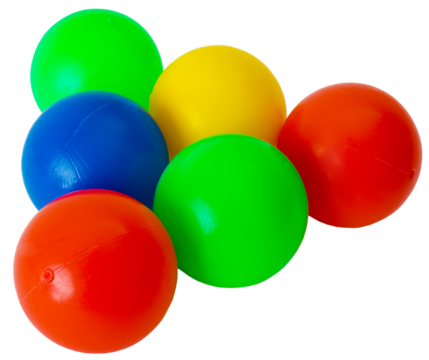
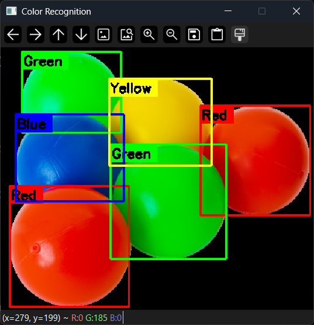
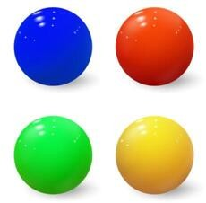
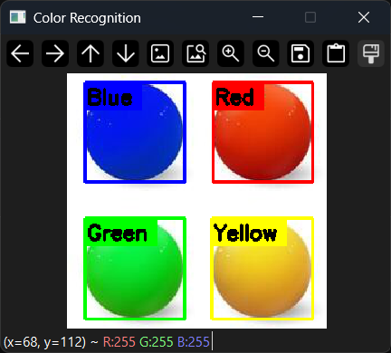

# OpenCV Color Recognition

## Project Overview

Color recognition is an important technique in computer vision that can be used in real-world applications such as industrial automation, quality inspection, object sorting, and robotic systems.

This project implements a color recognition system using **OpenCV** and **Python**.  
The system detects multiple colored objects in images and videos by using **HSV color segmentation**, creating masks for each color, and detecting objects using **contours**.

The supported colors are:
- Red
- Green
- Blue
- Yellow

## Technologies Used

- Python
- OpenCV
- NumPy
- Jupyter Notebook

## Features

- Detects multiple colors in an image or video.
- Uses HSV color space for accurate color segmentation.
- Creates color masks for object detection.
- Detects object boundaries using contours.
- Draws bounding boxes and color labels on detected objects.

## Processing Pipeline

The color recognition process follows these steps:

### 1. Input Image / Video

The program receives an image or video frame as input.

### 2. Convert BGR to HSV

The input image is converted from **BGR color space** to **HSV color space** because HSV provides better separation of colors.

### 3. Define Color Ranges and Create Masks

HSV color ranges are defined for each supported color. These ranges are then used with `cv2.inRange()` to create binary masks that extract pixels belonging to each color.

The system creates separate masks for:
- Red
- Green
- Blue
- Yellow
  
### 4. Detect Objects Using Contours

The program uses contours to identify the detected colored regions and calculate their boundaries.

### 5. Draw Bounding Boxes and Labels

Bounding boxes and color names are drawn around detected objects to display the recognition results.

## Results

### Detection with Multiple Objects and Repeated Colors

The system successfully detected multiple objects, including repeated colors and closely positioned objects.

**Input:**

**Result:**

---

### Detection with Separated Objects

The system successfully detected multiple colored objects when they were separated, producing clear bounding boxes and color labels.

**Input:**

**Result:**

## Project Files

- `Color_Recognition_Image.ipynb` – Notebook implementation for image color recognition.
- `Color_Recognition_Image.py` – Python implementation for image color recognition.
- `Color_Recognition_Video.py` – Python implementation for video color recognition.
